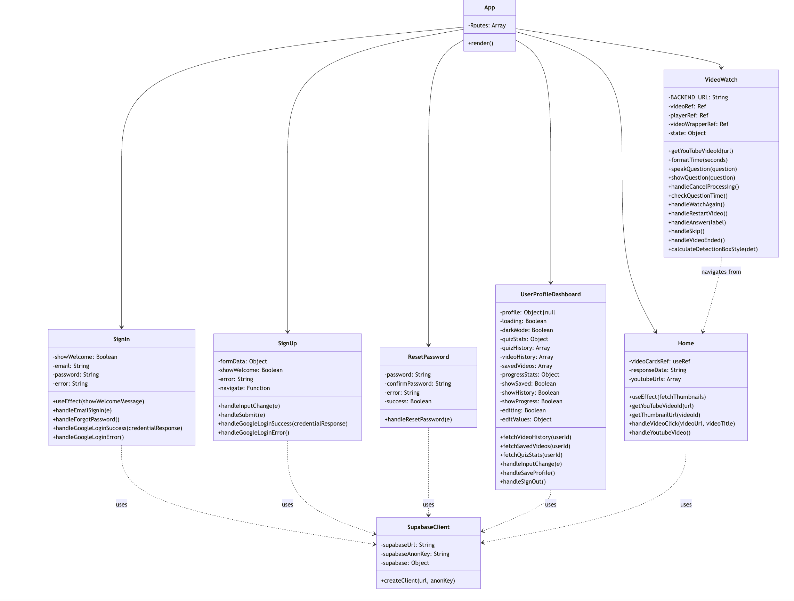

# Class Diagrams 

## Frontend Class Diagram

![Frontend Class Diagram]](image-4.png)

#### Figure 1.1: Frontend Component Relationships

The frontend class diagram illustrates the relationships between React components:

### App Component
The App component serves as the main entry point for the application, managing routing between different views through React Router. It coordinates navigation between the Home page, Video Watch page, User Profile Dashboard, and Authentication components.

**Key features:**

- Route management for navigation between components
- Entry point for the application
- Global state coordination

### Home Component
The Home component represents the landing page where users can discover content, search for videos, and begin their learning journey.

**Key features:**

- Video card display with thumbnails fetched from YouTube
- YouTube URL input and validation
- Video selection and navigation to the Watch page

### VideoWatch Component

The VideoWatch component is responsible for delivering the core interactive learning experience, handling video playback, question presentation, and user interactions.

**Key features:**

- Video player control (play, pause, restart)
- Question display at predefined timestamps
- Text-to-speech functionality for question reading
- User answer processing and feedback
- Detection box visualization for object recognition
- Video progress tracking

### Authentication Components

The authentication system consists of SignIn, SignUp, and ResetPassword components that handle user registration, login, and password management.

**Key features:**

- Email/password authentication
- Google OAuth integration
- Password reset functionality
- Form validation and error handling

### UserProfileDashboard Component

The UserProfileDashboard component provides users with a personalized space to view their learning progress, video history, and saved content.

**Key features:**

- User profile management
- Quiz statistics and historical performance
- Video history tracking
- Saved video management
- Learning progress visualization

### SupabaseClient
The SupabaseClient serves as the connection manager to the Supabase backend service, providing authentication and database functionality.

**Key features:**

- Client initialization and configuration
- Connection management to Supabase services

## Backend Class Diagram

#### Figure 1.2: Backend Class Diagram
The backend class diagram shows the organization of FastAPI routes, services, and database interactions:

### Main Application
The main FastAPI application serves as the entry point for the backend, configuring middleware, routes, and providing health check endpoints.

**Key Features:**

- API route registration
- CORS configuration
- Logging middleware
- Health check endpoints

### Authentication Router
The authentication router handles user registration, login, and token management through secure OAuth2 and JWT implementation.

**Key features:**

- User registration with email/password
- Secure login with JWT token generation
- Token validation and user retrieval

### Videos Router
The videos router manages video processing, question generation, and user interaction with video content.

**Key features:**

- Video analysis with YOLOv8 and GPT
- Question generation from video content
- Processing state management
- Answer validation and explanation

### CRUD Router
The CRUD router provides basic database operations for video engagement tracking and testing.

**Key features:**

- Create, read, update, and delete operations for video URLs
- Database connection testing
- Video engagement metrics

### AI and Machine Learning Components

#### YOLOv8 Object Detection

YOLOv8 is used for real-time object detection in video frames, identifying relevant content for question generation.

**Key features:**

- Object detection from base64-encoded images
- Bounding box generation with confidence scores
- Label identification for detected objects

####  GPT Helper

The GPT helper component interfaces with OpenAI's API to generate contextually relevant multiple-choice questions based on video content.

**Key features:**

- Question generation from video transcripts
- Multiple-choice answer creation
- JSON parsing and formatting

####  YouTube Data Retrieval
The YouTube component handles metadata and transcript retrieval from YouTube videos.

**Key features:**

- Video ID extraction from URLs
- Metadata retrieval (title, duration, etc.)
- Transcript fetching and processing

####  Database Components

The database models define the structure for storing user data, video information, and engagement metrics.

**Key features:**

- User authentication data (User_Login)
- Video engagement tracking (User_engagement)
- Question storage for videos (VideoQuestion)

#### Schema Definitions
The schema definitions provide validation rules for API requests and responses using Pydantic models.

**Key features:**

- Request validation
- Response formatting
- Data type enforcement

