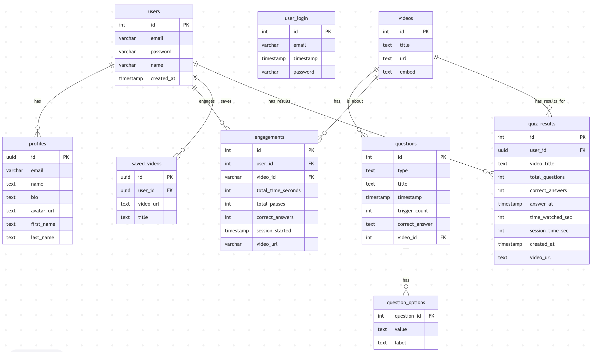

# Databases

The diagram above shows the entity relationship diagram for the databases used in this project as well as the structure of the tables within the databases. A postgresSQL database will be used to handle storing user credentials, video questions, user answers and progress, saved videos, and user video history.