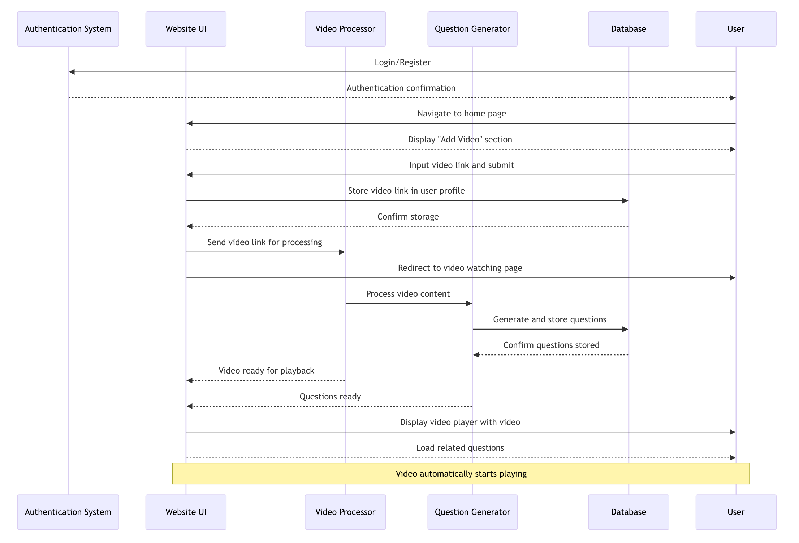

# Sequence Diagrams

## Use Case 1 - Creating an Account

## Use Case 2 - Logging In
   

## Use Case 3 - Resetting a Password

## Use Case 4 - Answering a Question During a Video

## Use Case 5 - Getting Results Immediately After Watching a Video

## Use Case 6 - Adding a Video

(

## Use Case 7 - Saving a Video to Watch Later

## Use Case 8 - Accessing Saved Videos

## Use Case 9 - Seeing Results from a Video Previously Watched

